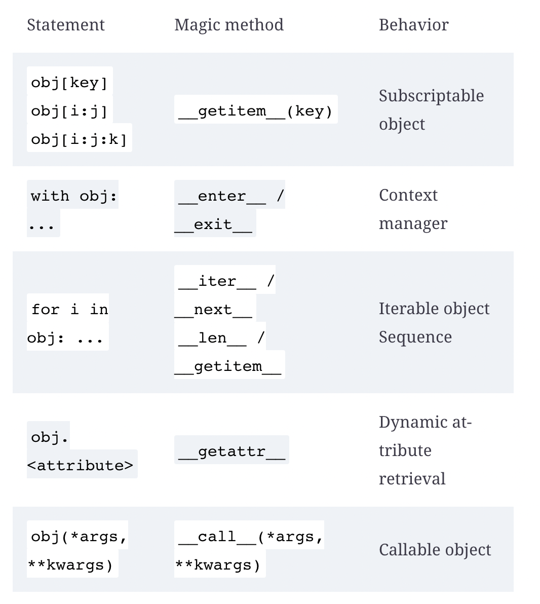

# Python Clean Code

# 2. Pythonic Code

* Python provides its own mechanisms for accomplishing common tasks
* Idiom: Type of way to write code in order to perform a specific task
  * Common and repeats the same structure every time
  * Way things should be written when we want to perform a particular task
  * Language dependent
  * Writing idiomatic code in the language usually helps performance
  * Allows entire team get used to the same patterns in the code
* Indexes and slices
  * First index is at `0`
  * With negative numbers can access indices in the array (negative number start counting from end of array, so `arr[-1]` is last element in list)
```python
>>> my_numbers = (4, 5, 3, 9)
>>> my_numbers[-1]
9
>>> my_numbers[-3]
5
```
  * Can use `slice` to obtain a subarray of a sequence 
  * Format is `[start:end:step]` (end is not inclusive) and they refer to array indices
  * Tuples and lists can both be sliced 
```python
>>> my_numbers = (1, 1, 2, 3, 5, 8, 13, 21)
>>> my_numbers[2:5]
(2, 3, 5)
```

  * Can also skip between elements 
```python
>>> my_numbers[:3]
(1, 1, 2)
>>> my_numbers[3:]
(3, 5, 8, 13, 21)
>>> my_numbers[::]  # also my_numbers[:], returns a copy
(1, 1, 2, 3, 5, 8, 13, 21)
>>> my_numbers[1:7:2]
(1, 3, 8)
```
  * returns a shallow copy of the subarray 
* Creating your Own Sequences
  * `magic methods` are those surrounded by `__`
  *  Need to implement `__getitem__` to create your own sequence
  *  This is the method that is called when   `myobject[key]` is called (key is the param)
  *  A sequence is an object which implements `__getitem__` and `__len__`
  *  Lists, tuples, and strings are example of built-in sequence objects
  *  If your custom sequence wraps a built-in sequence, than delegate to 
  *  Can inheret from `Sequence` ABC
```python
from collections.abc import Sequence
class Items(Sequence):
    def __init__(self, *values):
        self._values = list(values)
    def __len__(self):
        return len(self._values)
    def __getitem__(self, item):
        return self.__getitem__(item)
```
  * Any time we want our own implementation of a built-in object such as sequences and mappings we should inherit from ABC
  * In the above implementation we use composition of a list rather than inheritence
  * If not wrapping any built-in types keep in mind:
    * When indexing by range, result should be instance of same type of class
      * i.e. When you slice a range, you actually get a range, you don't get an array for example
```python
>>> range(1, 100)[25:50]
range(26, 51)
```
  * Consider developing classes using magic methods to follow the already existing Python built-in classes, which will make them easier to use
    * But make sure the use case agrees, don't try to force it to be fancy
* Context Managers
  * We use when we want some precondition and postcondition code to be run before performing an action (code to run before and after a certain main action)
  * Often occur around reasource management
    * i.e. when we open a file and then want to close after, when we open a connection and then want to close after
  * We need to have setup and cleanup code, but what if an exception occurs, we must have a way to run the cleanup code
    * Could do it `finally` clause, but more Pythonic to use Context Managers
```python
Before:
fd = open(filename)
try:
    process_file(fd)
finally:
    fd.close()

After: 
# open returns a file object with implementations of __enter__ and __exit__
with open(filename) as fd:
    process_file(fd)
```
  * `with` statement enters the context manager (`open` function implements the `context manager protocol`)
    * The file will be automatically closed when block is finished (even if exception occurs)
    * Two magic methods used, `__enter__` and `__exit__`
      * Whatever is returned from `__enter__` placed in variable defined with `as` 
      * When error occurs or last line of code is reached, `__exit__` method is called of current context manager
      * `__exit__` is even passed an exception if it occurs and you can handle it accordingly
  * We often want to use context managers when dealing with some limited resource which requires acquisition and cleanup
    * Notice we are isolating setup/cleanup from business logic, which is what we really want (`SOC`)
    * BP: Always return something on `__enter__`
```python
def stop_database():
    run("systemctl stop postgresql.service")
def start_database():
    run("systemctl start postgresql.service")
class DBHandler:
    def __enter__(self):
        stop_database()
        return self
    def __exit__(self, exc_type, ex_value, ex_traceback):
        start_database()
def db_backup():
    run("pg_dump database")
def main():
    with DBHandler():
        db_backup()
```
  * Even if error occurs, `__exit__` will still be called 
    * If no exception occurred, all params of `__exit__` are `None`
    * If you return `True` from `__exit__` it acts as catching the exception, but this is generally not the desired effect
    * BP: When possible, dont return `True` in `__exit__`, try to catch exceptions earlier or let them stop program
  * Implementing our Own Context Managers
    * Just need dto implement `__enter__` and `__exit__` magic methods and your object can act as a context manager
    * Can also use `contextlib` for non context managing objects into context managing objects
      * Note: Contains other useful methods around context mangement
    * `contextlib.contextmanager` can make a `generator` be used as context manager
      * Everything before the yield will act as `__enter__`, the yielded value is returned (and generator suspended) (this returned value can be stored with `with generator_cm() as <var_name>`), and then the code within the `with` block is run, and on error/on completion, everything after `yield` is run which acts as `__exit__` code
```python
import contextlib
@contextlib.contextmanager
def db_handler():
    try:
        stop_database()
        yield
    finally:
       start_database()
with db_handler():
    db_backup()
```
  * This is especially useful when you want a context manager that isn't associated with any particular object 
    * BP: Use context management for locks and semaphores, which ensures you don't forget to release them
  * This is usually a good idea when our context management code has little to with the class we are trying to make into a context manager/when we don't need the return value
  * But what if you want to turn a regular function into something that is context managed
    * Can use `contextlib.ContextDecorator` to create your own decorator class, and then use it to decorate your methods (or in your class hierarchy to allow other class to be context managers)
```python
class dbhandler_decorator(contextlib.ContextDecorator):
    def __enter__(self):
        stop_database()
        return self
    def __exit__(self, ext_type, ex_value, ex_traceback):
        start_database()
@dbhandler_decorator()
def offline_backup():
    run("pg_dump database")
```
  * Now you could call `offline_backup()` without any `with` and it will be called inside a context manager
```python
offline_backup()

# Is the same as...
try:
  __enter__()
  offline_backup()
except:
  __exit__()
finally:
  __exit__()

```
  * Especially useful for reusing logic
* Exception suppression
  * If you want to make it very obvious that certain exceptions are okay (remember, code should be obvious with little surprises)
```python
import contextlib
with contextlib.suppress(DataConversionException):
    parse_data(input_json_or_dict)
```
  * We are making it very clear that that any exception during data conversion can be ignored

* Comprehension and Assignment
  * Usually lead to more concise, easier to read code, but need to be careful because can become more complicated
  * However most cases where we need to generate a list, dictionary, tuple are simple transformations
  * Simple comprehensions are of the form (`op` can be a `NOP`)
```python
var = [op(val) for val in list if <some_expression>]
```
  * This can produce `map` and `filter`
  * Also usually more performant
  * Below is an example of converting `for` loops into a comprehension
```python
# Before
from typing import Iterable, Set
def collect_account_ids_from_arns(arns: Iterable[str]) -> Set[str]:
    """Given several ARNs in the form
        arn:partition:service:region:account-id:resource-id
    Collect the unique account IDs found on those strings, and return them.
    """
    collected_account_ids = set()
    for arn in arns:
        matched = re.match(ARN_REGEX, arn)
        if matched is not None:
            account_id = matched.groupdict()["account_id"]
            collected_account_ids.add(account_id)
    return collected_account_ids

# After
def collect_account_ids_from_arns(arns):
    matched_arns = filter(None, (re.match(ARN_REGEX, arn) for arn in arns))
    return {m.groupdict()["account_id"] for m in matched_arns}
```
  * Note: the tuple comprehension and the use of `filter` to remove all `None` values
  * `Assignment Expressions`
    * `temp_var := expression` sets a temporary variable inside a scope
    * Usually more performant
    * TODO: Look into this more

* Properties
  * Python has no notion of `public`, `private`, `protected`, every method/properties is public
  * If a method/property with `_` then they are considered `private`, but still client code can access them, its just a convention to not do this
  * We should feel safe updating any `_` method/property and maintaining all public methods since it keeps object backwards compatible
  * BP: Hide everything not absolutely necessary to client code
  * You could use `_` methods/props within unit tests, but still may not be a good idea since now causing more coupling between test code and client code
  * Name mangling 
    * Properties with names starting with `__` get mangled, so some people use it to make methods/properties private
```python
>>> class Connector:
...     def __init__(self, source):
...         self.source = source
...         self.__timeout = 60
...
...      def connect(self):
...         print("connecting with {0}s".format(self.__timeout))
...         # ...
... 
>>> conn = Connector("postgresql://localhost")
>>> conn.connect()
connecting with 60s
>>> conn.__timeout
Traceback (most recent call last):
  File "<stdin>", line 1, in <module>
AttributeError: 'Connector' object has no att
```
  * We may think this is the desired effect, but actually Python has just renamed the property to `_Connector__timeout` and can still be accessed with this name
  * This was done to be able to extend/override the class methods within children classes without risk of collision 
    * So by using `__` for `private` vars, it seems like a hacky approach and we shouldn't do it 
  * `Properties` for attributes we want to access
    * Often we want to place constraints on the attributes of our objects (i.e. timeout can't be negative) and we can use Python `properties` to make an attribute a property and set a constraint on `@<prop_name>.setter` decorator
```python
class Coordinate:
    def __init__(self, lat: float, long: float) -> None:
        self._latitude = self._longitude = None
        self.latitude = lat
        self.longitude = long
    @property
    def latitude(self) -> float:
        return self._latitude
    @latitude.setter
    def latitude(self, lat_value: float) -> None:
        if lat_value not in range(-90, 90 + 1):
            raise ValueError(f"{lat_value} is an invalid value for latitude")
        self._latitude = lat_value
    @property
    def longitude(self) -> float:
        return self._longitude
    @longitude.setter
    def longitude(self, long_value: float) -> None:
        if long_value not in range(-180, 180 + 1):
            raise ValueError(f"{long_value} is an invalid value for longitude")
        self._longitude = long_value
```
 * Now `coord.latitude` will return the `private` instance variable and changing latitude or longitude with something like `coord.latitude = <new_val>` will call the setter method instead, and this is where you can put your validation
 * BP: Don't write a bunch of `get/set` methods if they aren't required, if you want to do validation or change what is returned on get, use `properties`
 * `properties` can also help achieve `command and query seperation`
   * Method of an object should either `query` (no change in state, but returns value)or `command` (change in state, but no return), but not both
   * This means we should not be returning the status of commands, since that makes a `command` do more than one thing
   * The reason for this is that it is hard to know from reading the code what is returned on the `
   * Your `@property` becomes your `query` command, and `@<prop_name>.setter` becomes your command
 * This follows from the more general principle that a method should do precisely one thing, which is why we shouldn't update the value and then check it, since that is two things

* Creating Classes More Compactly
  * This is a common occurrence within Python code (and OOP code in general)
```python
def __init__(self, x, y, … ):
    self.x = x
    self.y = y
```
 * The solution to this is `dataclasses` in `Python 3.7` 
 * It takes all the class attributes with type annotations and converts them to instance attributes and generates the `__init__` method for us
 * We can also override `__post_init__` in order to perform validations or update the attributes
   * We see the theme here for making the common case fast
 * Below, is an example of using __post_init__ for checking the value of attributes after initialization and using `field` to return a default value of a list without having the issues of defining first as `None`
```python
from typing import List
from dataclasses import dataclass, field
R = 26
@dataclass
class RTrieNode:
    size = R
    value: int
    next_: List["RTrieNode"] = field(
        default_factory=lambda: [None] * R)
 
    def __post_init__(self):
        if len(self.next_) != self.size:
            raise ValueError(f"Invalid length provided for next list")
```
 * Simple objects which serve more as a data container should be created with `dataclass` 

* Iterable objects
  * Remember, in Python, everything is an object
  * Python allows objects to be `iterable` by overriding some magic methods (recall we can make objects `sequence` objects by overriding `__getitem__` and `__len__`)
  * Can make an object `iterable` by overriding `__next__` and `__iter__`
  * `sequence` and `iterable` objects can both be used within a `for` loop
```python
from datetime import timedelta
class DateRangeIterable:
    """An iterable that contains its own iterator object."""
    def __init__(self, start_date, end_date):
        self.start_date = start_date
        self.end_date = end_date
        self._present_day = start_date
    def __iter__(self):
        return self
    def __next__(self):
        if self._present_day >= self.end_date:
            raise StopIteration()
        today = self._present_day
        self._present_day += timedelta(days=1)
        return today
```
 * Many times `__iter__` just returns `self` when we define `__next__` on the same object
 * We use `StopIteration()` when we are done iterating
 * Now, our iterator can be used as follows (rememeber, `__iter__` returns the object we will be iterating over, which is usually the object we have after `in`) 
   * i.e. python will call `iter()` function on our object, calling `__iter__` returning our iterator
   * You can also call `iter()` on objects and use `next()` to manually iterate 
```python
>>> from datetime import date
>>> for day in DateRangeIterable(date(2018, 1, 1), date(2018, 1, 5)):
...     print(day)
... 
2018-01-01
2018-01-02
2018-01-03
2018-01-04
```

```python
>>> r = DateRangeIterable(date(2018, 1, 1), date(2018, 1, 5))
>>> next(r)
datetime.date(2018, 1, 1)
>>> next(r)
datetime.date(2018, 1, 2)
>>> next(r)
datetime.date(2018, 1, 3)
>>> next(r)
datetime.date(2018, 1, 4)
>>> next(r)
Traceback (most recent call last):
  File "<stdin>", line 1, in <module>
  File ... __next__
    raise StopIteration
StopIteration
>>> 
```
 * However, we have to be careful with using `self` in `__iter__` since now we cannot have use in `for` loops consecutively, since `StopIteration()` will be raised immediately
   * We can do things such as reset vars on `__iter__`, create a new object instance, or we can make `__iter__` a generator (which is just an iterator object) (since we continuously call next on them)
```python
class DateRangeContainerIterable:
    def __init__(self, start_date, end_date):
        self.start_date = start_date
        self.end_date = end_date
    def __iter__(self):
        current_day = self.start_date
        while current_day < self.end_date:
            yield current_day
            current_day += timedelta(days=1)
```
 * This is called `container iterables` since we are returning a new generator each time `__init__` is called

* Creating `sequence` objects
  * Note we don't need the `__iter__` method to iterate over our object, we can make our object a `sequence` object overriding `__getitem__` and `__len__` (`iter()` will look for `__getitem__` if it doesn't find `__iter__`, and then if not found will raise `TypeError`)
  * This is especially useful over the iterator approach if we want to be able to get the `nth` element without iterating over the sequence
  * Basically, use `iterator` when memory is biggest priority/issue, and `sequence` approach when speed is biggest priority
  * We can do similar what we did above by using a sequence object, and can iterate over it a similar way
```python
class DateRangeSequence:
    def __init__(self, start_date, end_date):
        self.start_date = start_date
        self.end_date = end_date
        self._range = self._create_range()
    def _create_range(self):
        days = []
        current_day = self.start_date
        while current_day < self.end_date:
            days.append(current_day)
            current_day += timedelta(days=1)
        return days
    def __getitem__(self, day_no):
        return self._range[day_no]
    def __len__(self):
        return len(self._range)

>>> s1 = DateRangeSequence(date(2018, 1, 1), date(2018, 1, 5))
>>> for day in s1:
...     print(day)
... 
2018-01-01
2018-01-02
2018-01-03
2018-01-04
>>> s1[0]
datetime.date(2018, 1, 1)
>>> s1[3]
datetime.date(2018, 1, 4)
>>> s1[-1]
datetime.date(2018, 1, 4)
```

### Container Objects
* Objects which implemnet a `__contains__` which usually returns a boolean value and can be used with the `in` keyword
```python
element in container
# becomes...
container.__contains__(element)
```
* Whenever we need the conceptual operation of checking if an item is in a container of items, we can make our object a container by overriding the `__contains__` method
```python
class Boundaries:
    def __init__(self, width, height):
        self.width = width
        self.height = height
    def __contains__(self, coord):
        x, y = coord
        return 0 <= x < self.width and 0 <= y < self.height
class Grid:
    def __init__(self, width, height):
        self.width = width
        self.height = height
        self.limits = Boundaries(width, height)
    def __contains__(self, coord):
        return coord in self.limits
```
 * Notice here we even did it twice by delegating our contains to an instance attribute, hiding the complexity from the user 


### Dynamic Attributes 
* When we try to access the attribute of an object, Python will check the `__dict__` of the object to see if it exists, and if it isn't found, `__getattr__` is called, passing the name of the attribute as a paramater
```python 
class DynamicAttributes:
    def __init__(self, attribute):
        self.attribute = attribute
    def __getattr__(self, attr):
        if attr.startswith("fallback_"):
            name = attr.replace("fallback_", "")
            return f"[fallback resolved] {name}"
        raise AttributeError(
            f"{self.__class__.__name__} has no attribute {attr}"
        )

>>> dyn = DynamicAttributes("value")
>>> dyn.attribute
'value'
>>> dyn.fallback_test
'[fallback resolved] test'
>>> dyn.__dict__["fallback_new"] = "new value"
>>> dyn.fallback_new
'new value'
>>> getattr(dyn, "something", "default")
'default'
```
  * Notice that when found (i.e. when we manually defined `fallback_new` in our `__dict__`), that `__getattr__` isn't called 
  * In the last example, `AttributeError` is raised, which is caught by `getattr` (make sure to raise `AttributeError` when overriding `__getattr__`)

### Callable Objects
* Sometimes we want to create objects that act as functions (useful for creating better decorators)
* To do this, we override `__call__` magic method
  * Every arguement passed to function is passed along to `__call__` method
  * Also useful if we want to maintain state across function calls, since objects can very easily maintain state
```python
object(*args, **kwargs)
# becomes...
object.__call__(*args, **kwargs)
```
```python
from collections import defaultdict
class CallCount:
    def __init__(self):
        self._counts = defaultdict(int)
    def __call__(self, argument):
        self._counts[argument] += 1
        return self._counts[argument]

>>> cc = CallCount()
>>> cc(1)
1
>>> cc(2)
1
>>> cc(1)
2
>>> cc(1)
3
>>> cc("something")
1
>>> callable(cc)
    True
```
  * I personally like this approach for maintaining a cache to be used with your function

### Magic Method Summary

* One major tip is if you want to make sure you do it correctly you make your class inherit from the corresponding `ABC` by inheriting from the correct class in `collections.abc` 

## Caveats/Things to Avoid
* All idioms have their problems which you have to watch out for (everything looks like a nail to the man with only a hammer)

### Mutable default args
* The default args in function definitions are created once and the params are just references to them
  * This means that if the object is mutable, then all calls to the function will be pointing at this mutable arg, and if one call mutates it, this mutation can be seen across calls
```python
def wrong_user_display(user_metadata: dict = {"name": "John", "age": 30}):
    name = user_metadata.pop("name")
    age = user_metadata.pop("age")
    return f"{name} ({age})"
```
* The dictionary is created only once and is the same for the life of the program
* Need to make it `None` and then edit inside of the function

### Extending Built In Types
* When you want to extend a built-in type, the optimizations from `CPython` can cause issues (i.e. if you inherit from `list` and override `__getitem__`, may have issues in `for` loop)
* Instead you want to inherit from `collections` module
```python
class BadList(list):
    def __getitem__(self, index):
        value = super().__getitem__(index)
        if index % 2 == 0:
            prefix = "even"
        else:
            prefix = "odd"
        return f"[{prefix}] {value}"

>>> bl = BadList((0, 1, 2, 3, 4, 5))
>>> bl[0]
'[even] 0'
>>> bl[1]
'[odd] 1'
>>> "".join(bl)
Traceback (most recent call last):
...
TypeError: sequence item 0: expected str instan
```
 * Notice how `join` will try to iterate over `bl`, but has issues due to the optimizaition
   * Notice how our implementation of `__getitem__` wasn't called since we would expect a `str` to be returned and `join` to work
 * To do this properly, inherit from `collections.UserList`...

```python
from collections import UserList
class GoodList(UserList):
    def __getitem__(self, index):
        value = super().__getitem__(index)
        if index % 2 == 0:
            prefix = "even"
        else:
            prefix = "odd"
        return f"[{prefix}] {value}"

>>> gl = GoodList((0, 1, 2))
>>> gl[0]
'[even] 0'
>>> gl[1]
'[odd] 1'
>>> "; ".join(gl)
'[even] 0; [odd] 1; [even] 2'
```

## Intro to Async Code
* For the purpose of when we perform an I/O operation, we want our CPU bound code to continue to run, and then handle when the I/O code completes
