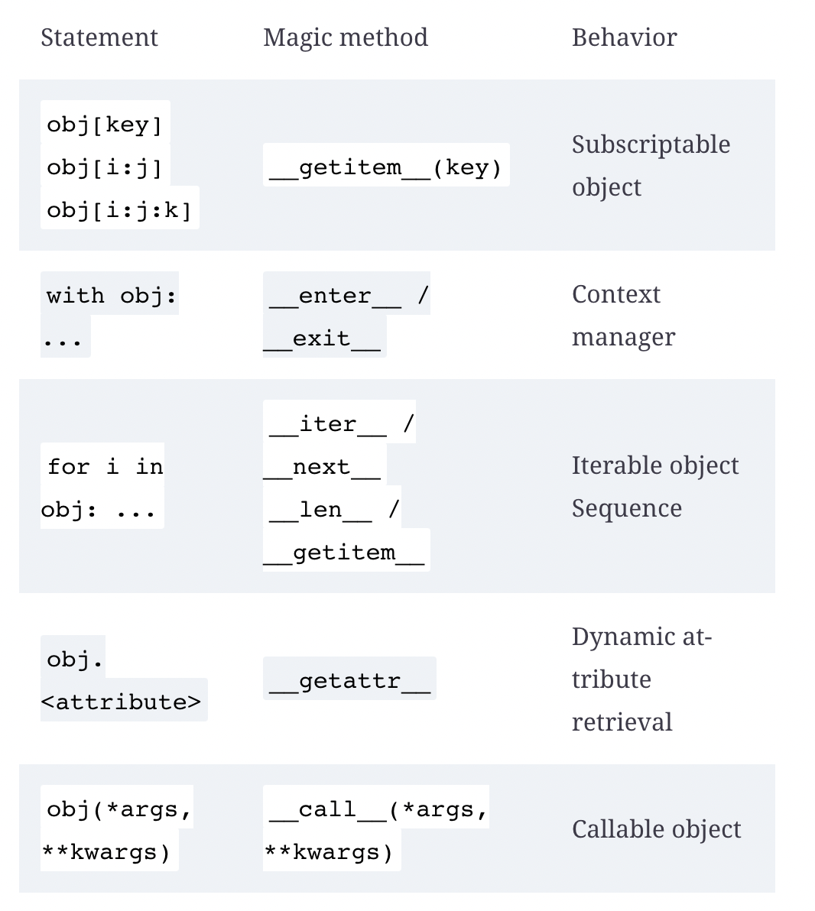
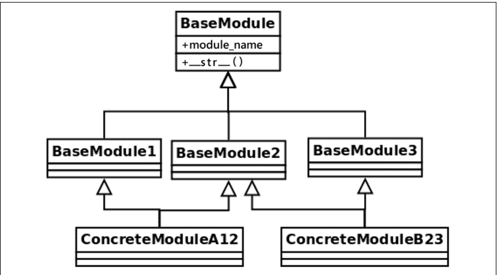

## 1. Intro
* Without quality code, projects fail due to the accumulation of technical debt
* Clean code not something a machine or script can recognize, but rather we as sofware engineering professionals must decide
  * One interesting is "# of WTFs" which is derived from the lack of surprises within the code
* The true imperative of programming is expressing to another developer what we want the computer to do
* Consistently think about reading the code from another engineers perspective
  * Consider the documentation, testing, etc.
  * Consider what may be surprising or confusing, and try to remove this confusion
* When we look at programming languages as a common language between developer rather than between us and the machine, quality/clarity comes to the forefront
* You need to be able to read a piece of code and say what is good and bad about, what is clear/unclear, and what could be done better
* Importance of clean code
  * As Uncle Bob states, lack of code cleanness/clarity causes features/releases to slowly take more and more time until development grinds to halt
  * We want to be able to implement continuous integration and delivery, we must be consistenly fixing bugs and making features, and this speed can only be facilitated if things are kept extremely clean
  * Poor code quality and not having the correct verification pipeline in place (DevOps!), makes the estimation process for a new feature nearly impossible, since there is so much uncertainty within the codebase, things are so coupled, dependencies are unclear etc.
    * This also applies to code readability, the harder it is to read and understand, the harder it will be to add new features
* `technical debt`: Problems in the software as a result of a compromise or a bad decision being made (usually as a result of time or laziness)
  * From past perspective: The problems we are experiencing today are a result of poor decisions made in the past (make sure to identify these poor decisions)
  * From future perspective: If we take a shortcut today, what problems are we creating for ourself in the future (consider specific problems in how the code could change)
  * `debt` is used since the code base gets harder and more expensive to change in the future
  * Could be argued that a codebase with lots of technical debt becomes rigid, which is the exact opposite of the agile methodology
  * It is easy to take-on and very tempting, and will not impact today, but over time the debt will grind the entire project to a halt
    * Things could become more dire when the tech debt can cause intermittent issues (i.e. poor memory management causing a crash only under certain conditions)
* We need thorough code reviews, automated testing, and tooling to maintain standards
* `Software is useful to the degree to which it can be easily changed`
* The only exception is code that will never possibly be needed to changed again in the future (and even then some consideration for quality should be considered)
* Code Formatting/Style Guide
  * Important to keep consistent standards such as `PEP-8` 
  * First step when creating any project is have some sort of mechanism for enforcing style
  * Consistency is everything when it comes to code formatting
    * If you use `'` rather than `"`, be consistent, if you use `get` don't also use `retrieve`, if you use `generate` don't also use `build`, etc.
  * Make sure to consider how the team currently likes structuring things (do they like defining classes, or using modules with function definitions)
  * `PEP-8`
    * Make sure to have a document which is explicit on code style
    * Has recomendations to reduce as much as possible the code with `try/except` blocks to reduce the probability of an accidental error being caught (hiding bugs)
* Documentation
  * Docstrings/annotations important since Python is a dynamically typed language, it can be hard to keep track of the values of variables
    * Can use like `mypy` to allow for type hinting
  * Code comments
    * Should aim to have as few as possible
    * Before writing a comment, should aim to express that comment in code
    * However, very important when there is something strange within the code
    * No matter what, try not to comment out code, we have version control for a reason
  * TL;DR documentation good, code comments bad
  * Docstrings
    * Meant to provide documentation to a particular component (`module`, `class`, `method`, `function`)
    * Forces you to think of the usability/reuse of the methods you are writing
    * The more likely it is to be reused, the more extent of detail/clarity should be given
    * Must answer what kind of inputs does it take, what kind of output does it give
    * Also useful for generating documentation, as well as allowing other developers to read it through the IDE
    * Once you have the doc strings in place, many tools can make this accessible, but bottom line you have to have them
    * For extremely simple and self-evident functions, probably don't need docstrings (since they must be maintained over time)
    * Can access on an object with `__doc__` attribute
  * We must view documentation as part of the code, it is part of the deliverable
  * When you make changes to code, make sure to read documentation to ensure it is still up to date (UPDATING DOCS IS PART OF DELIVERABLE)
* Type Annotations
  * Way to provide hints to reader the expected value of params/return value of functions
  * Types are not the only that can be used as annotations, any valid Python can be used
  * Notice how below we are not only being expressive, but have created a slight abstraction (could change `Seconds` to be an `int` in the future)
```python
Seconds = float
def launch_task(delay: Seconds):
    ...
```
  * Can access type annotations with `__annotations__` attribute 
  * BP: Configure `mypy` or `pytype` in projects so they can check type annotations and violations
  * BP: Utilize type annotiations as way to abstract the types of your code so they can easily be changed (thinking at the level of abstraction of entities rather than the types that make them up)
```python
Before:
def process_clients(clients: list[tuple[int, str]]):
    ...

After:
from typing import Tuple
Client = Tuple[int, str]
def process_clients(clients: list[Client]):
    ...
```
  * Also provides a good way to enforce an interface (will see more when looking at OOP in Python)
* Annotations vs. Docstrings
  * BP: No longer put types in Docstrings, but still should out a general explanation, example in/out values if they are complicated, special notes, and anything the response raises (likely only a good idea to use example in/out for public APIs)
* Tooling
  * Questions to ask about code written by a peer:
    * `Is it easy to understand and follow to a fellow programmer`
    * `Does it speak in terms of the domain of the problem` (think of code as real world entities interacting)
    * `Would a new person joining the team be able to understand it, and work with it effectively`
  * Tools must be put in place as part of CI/CD pipeline for checking things like types and formatting
    * If checks don't pass, make the build fail
    * Means no comments required to enforce it
  * Must be able to run locally and as part of CI build
  * Type Consistency
    * `mypy`
      * Optional static type checking in python
      * `pip install mypy` and useful to have as a project dependency (atleast as a dev dependency)
      * NOTE: Make when starting a new project to create a `venv` for it, so you can effectively generate a `requirements.txt` 
      * The more specific with what is a valid type the better `mypy` will be at detecting issues 
        * i.e. using `Iterable[str]` can be list/tuple of strings, or just a string, so you want to make sure that a string would also be valid here or it will slip through the cracks
    * `pytype` is similar but allows for intermediate invalid states as long as the final state will be the correct type, which can be considered good/bad based on situation, likely just use `mypy`
  * Generic validations in code
    * For enforcing `PEP-8` standards `pycodestyle` and `flake8` are both good tools
    * Basically go through files and check for `PEP-8` violations
    * `pylint` is tool which is configurable and enforces more strict standards (also install in `venv` so it can be added as a dep)
      * Can be configured with `pylintrc` file 
      * BP: Configure coding standards in these configuration files for these tools that enforce these standards
      * Even allows for plugins to be installed/wrote for more specific issues within code
  * `black` 
    * Allows for strict automated code formatting that is a deterministic subset of `PEP-8`
    * Can call `black -l 79 *.py` to format all python files 
    * Also has a `--check` option which could be useful in `CI/CD` 
    * Must format complete files
  * `yapf` is a more customizable code formatter and allows for partial formatting
  * BP: Use `black` in new repositories, but consider `yapf` for migrating old ones (since you can do `yapf` more incrementally)
* Setup for auto checks
  * Generally `Makefile` are used to configure commands to be run for compiling/running/checking/etc.
  * Usually put in root of project and used in both local development and CI workloads (just calling commands in the shell)
```Makefile
.PHONY: typehint
typehint:
	mypy --ignore-missing-imports src/
.PHONY: test
test:
	pytest tests/
.PHONY: lint
lint:
	pylint src/
.PHONY: checklist
checklist: lint typehint test
.PHONY: black
black:
	black -l 79 *.py
.PHONY: clean
clean:
	find . -type f -name "*.pyc" | xargs rm -fr
	find . -type d -name __pycache__ | xargs rm -fr
```
* And then you could run `make checklist` in your local/CI environments
* Makefiles extra useful since underlying tooling can be changed (i.e. change our test driver, change our formatting tool) but `make test`, `make format`, `make lint` will always be valid
* Should also configure CI tool to call commands in `Makefile` for consistency
* Summary
  * Clean code is a requirement for any code which will be needed to ever be changed in the future
  * Python utilizes `mypy` for checking type annotations, `pylint` for linting, and `black` for code formatting

# 2. Pythonic Code

* Python provides its own mechanisms for accomplishing common tasks
* Idiom: Type of way to write code in order to perform a specific task
  * Common and repeats the same structure every time
  * Way things should be written when we want to perform a particular task
  * Language dependent
  * Writing idiomatic code in the language usually helps performance
  * Allows entire team get used to the same patterns in the code
* Indexes and slices
  * First index is at `0`
  * With negative numbers can access indices in the array (negative number start counting from end of array, so `arr[-1]` is last element in list)
```python
>>> my_numbers = (4, 5, 3, 9)
>>> my_numbers[-1]
9
>>> my_numbers[-3]
5
```
  * Can use `slice` to obtain a subarray of a sequence 
  * Format is `[start:end:step]` (end is not inclusive) and they refer to array indices
  * Tuples and lists can both be sliced 
```python
>>> my_numbers = (1, 1, 2, 3, 5, 8, 13, 21)
>>> my_numbers[2:5]
(2, 3, 5)
```

  * Can also skip between elements 
```python
>>> my_numbers[:3]
(1, 1, 2)
>>> my_numbers[3:]
(3, 5, 8, 13, 21)
>>> my_numbers[::]  # also my_numbers[:], returns a copy
(1, 1, 2, 3, 5, 8, 13, 21)
>>> my_numbers[1:7:2]
(1, 3, 8)
```
  * returns a shallow copy of the subarray 
* Creating your Own Sequences
  * `magic methods` are those surrounded by `__`
  *  Need to implement `__getitem__` to create your own sequence
  *  This is the method that is called when   `myobject[key]` is called (key is the param)
  *  A sequence is an object which implements `__getitem__` and `__len__`
  *  Lists, tuples, and strings are example of built-in sequence objects
  *  If your custom sequence wraps a built-in sequence, than delegate to 
  *  Can inheret from `Sequence` ABC
```python
from collections.abc import Sequence
class Items(Sequence):
    def __init__(self, *values):
        self._values = list(values)
    def __len__(self):
        return len(self._values)
    def __getitem__(self, item):
        return self.__getitem__(item)
```
  * Any time we want our own implementation of a built-in object such as sequences and mappings we should inherit from ABC
  * In the above implementation we use composition of a list rather than inheritence
  * If not wrapping any built-in types keep in mind:
    * When indexing by range, result should be instance of same type of class
      * i.e. When you slice a range, you actually get a range, you don't get an array for example
```python
>>> range(1, 100)[25:50]
range(26, 51)
```
  * Consider developing classes using magic methods to follow the already existing Python built-in classes, which will make them easier to use
    * But make sure the use case agrees, don't try to force it to be fancy
* Context Managers
  * We use when we want some precondition and postcondition code to be run before performing an action (code to run before and after a certain main action)
  * Often occur around reasource management
    * i.e. when we open a file and then want to close after, when we open a connection and then want to close after
  * We need to have setup and cleanup code, but what if an exception occurs, we must have a way to run the cleanup code
    * Could do it `finally` clause, but more Pythonic to use Context Managers
```python
Before:
fd = open(filename)
try:
    process_file(fd)
finally:
    fd.close()

After: 
# open returns a file object with implementations of __enter__ and __exit__
with open(filename) as fd:
    process_file(fd)
```
  * `with` statement enters the context manager (`open` function implements the `context manager protocol`)
    * The file will be automatically closed when block is finished (even if exception occurs)
    * Two magic methods used, `__enter__` and `__exit__`
      * Whatever is returned from `__enter__` placed in variable defined with `as` 
      * When error occurs or last line of code is reached, `__exit__` method is called of current context manager
      * `__exit__` is even passed an exception if it occurs and you can handle it accordingly
  * We often want to use context managers when dealing with some limited resource which requires acquisition and cleanup
    * Notice we are isolating setup/cleanup from business logic, which is what we really want (`SOC`)
    * BP: Always return something on `__enter__`
```python
def stop_database():
    run("systemctl stop postgresql.service")
def start_database():
    run("systemctl start postgresql.service")
class DBHandler:
    def __enter__(self):
        stop_database()
        return self
    def __exit__(self, exc_type, ex_value, ex_traceback):
        start_database()
def db_backup():
    run("pg_dump database")
def main():
    with DBHandler():
        db_backup()
```
  * Even if error occurs, `__exit__` will still be called 
    * If no exception occurred, all params of `__exit__` are `None`
    * If you return `True` from `__exit__` it acts as catching the exception, but this is generally not the desired effect
    * BP: When possible, dont return `True` in `__exit__`, try to catch exceptions earlier or let them stop program
  * Implementing our Own Context Managers
    * Just need dto implement `__enter__` and `__exit__` magic methods and your object can act as a context manager
    * Can also use `contextlib` for non context managing objects into context managing objects
      * Note: Contains other useful methods around context mangement
    * `contextlib.contextmanager` can make a `generator` be used as context manager
      * Everything before the yield will act as `__enter__`, the yielded value is returned (and generator suspended) (this returned value can be stored with `with generator_cm() as <var_name>`), and then the code within the `with` block is run, and on error/on completion, everything after `yield` is run which acts as `__exit__` code
```python
import contextlib
@contextlib.contextmanager
def db_handler():
    try:
        stop_database()
        yield
    finally:
       start_database()
with db_handler():
    db_backup()
```
  * This is especially useful when you want a context manager that isn't associated with any particular object 
    * BP: Use context management for locks and semaphores, which ensures you don't forget to release them
  * This is usually a good idea when our context management code has little to with the class we are trying to make into a context manager/when we don't need the return value
  * But what if you want to turn a regular function into something that is context managed
    * Can use `contextlib.ContextDecorator` to create your own decorator class, and then use it to decorate your methods (or in your class hierarchy to allow other class to be context managers)
```python
class dbhandler_decorator(contextlib.ContextDecorator):
    def __enter__(self):
        stop_database()
        return self
    def __exit__(self, ext_type, ex_value, ex_traceback):
        start_database()
@dbhandler_decorator()
def offline_backup():
    run("pg_dump database")
```
  * Now you could call `offline_backup()` without any `with` and it will be called inside a context manager
```python
offline_backup()

# Is the same as...
try:
  __enter__()
  offline_backup()
except:
  __exit__()
finally:
  __exit__()

```
  * Especially useful for reusing logic
* Exception suppression
  * If you want to make it very obvious that certain exceptions are okay (remember, code should be obvious with little surprises)
```python
import contextlib
with contextlib.suppress(DataConversionException):
    parse_data(input_json_or_dict)
```
  * We are making it very clear that that any exception during data conversion can be ignored

* Comprehension and Assignment
  * Usually lead to more concise, easier to read code, but need to be careful because can become more complicated
  * However most cases where we need to generate a list, dictionary, tuple are simple transformations
  * Simple comprehensions are of the form (`op` can be a `NOP`)
```python
var = [op(val) for val in list if <some_expression>]
```
  * This can produce `map` and `filter`
  * Also usually more performant
  * Below is an example of converting `for` loops into a comprehension
```python
# Before
from typing import Iterable, Set
def collect_account_ids_from_arns(arns: Iterable[str]) -> Set[str]:
    """Given several ARNs in the form
        arn:partition:service:region:account-id:resource-id
    Collect the unique account IDs found on those strings, and return them.
    """
    collected_account_ids = set()
    for arn in arns:
        matched = re.match(ARN_REGEX, arn)
        if matched is not None:
            account_id = matched.groupdict()["account_id"]
            collected_account_ids.add(account_id)
    return collected_account_ids

# After
def collect_account_ids_from_arns(arns):
    matched_arns = filter(None, (re.match(ARN_REGEX, arn) for arn in arns))
    return {m.groupdict()["account_id"] for m in matched_arns}
```
  * Note: the tuple comprehension and the use of `filter` to remove all `None` values
  * `Assignment Expressions`
    * `temp_var := expression` sets a temporary variable inside a scope
    * Usually more performant
    * TODO: Look into this more

* Properties
  * Python has no notion of `public`, `private`, `protected`, every method/properties is public
  * If a method/property with `_` then they are considered `private`, but still client code can access them, its just a convention to not do this
  * We should feel safe updating any `_` method/property and maintaining all public methods since it keeps object backwards compatible
  * BP: Hide everything not absolutely necessary to client code
  * You could use `_` methods/props within unit tests, but still may not be a good idea since now causing more coupling between test code and client code
  * Name mangling 
    * Properties with names starting with `__` get mangled, so some people use it to make methods/properties private
```python
>>> class Connector:
...     def __init__(self, source):
...         self.source = source
...         self.__timeout = 60
...
...      def connect(self):
...         print("connecting with {0}s".format(self.__timeout))
...         # ...
... 
>>> conn = Connector("postgresql://localhost")
>>> conn.connect()
connecting with 60s
>>> conn.__timeout
Traceback (most recent call last):
  File "<stdin>", line 1, in <module>
AttributeError: 'Connector' object has no att
```
  * We may think this is the desired effect, but actually Python has just renamed the property to `_Connector__timeout` and can still be accessed with this name
  * This was done to be able to extend/override the class methods within children classes without risk of collision 
    * So by using `__` for `private` vars, it seems like a hacky approach and we shouldn't do it 
  * `Properties` for attributes we want to access
    * Often we want to place constraints on the attributes of our objects (i.e. timeout can't be negative) and we can use Python `properties` to make an attribute a property and set a constraint on `@<prop_name>.setter` decorator
```python
class Coordinate:
    def __init__(self, lat: float, long: float) -> None:
        self._latitude = self._longitude = None
        self.latitude = lat
        self.longitude = long
    @property
    def latitude(self) -> float:
        return self._latitude
    @latitude.setter
    def latitude(self, lat_value: float) -> None:
        if lat_value not in range(-90, 90 + 1):
            raise ValueError(f"{lat_value} is an invalid value for latitude")
        self._latitude = lat_value
    @property
    def longitude(self) -> float:
        return self._longitude
    @longitude.setter
    def longitude(self, long_value: float) -> None:
        if long_value not in range(-180, 180 + 1):
            raise ValueError(f"{long_value} is an invalid value for longitude")
        self._longitude = long_value
```
 * Now `coord.latitude` will return the `private` instance variable and changing latitude or longitude with something like `coord.latitude = <new_val>` will call the setter method instead, and this is where you can put your validation
 * BP: Don't write a bunch of `get/set` methods if they aren't required, if you want to do validation or change what is returned on get, use `properties`
 * `properties` can also help achieve `command and query seperation`
   * Method of an object should either `query` (no change in state, but returns value)or `command` (change in state, but no return), but not both
   * This means we should not be returning the status of commands, since that makes a `command` do more than one thing
   * The reason for this is that it is hard to know from reading the code what is returned on the `
   * Your `@property` becomes your `query` command, and `@<prop_name>.setter` becomes your command
 * This follows from the more general principle that a method should do precisely one thing, which is why we shouldn't update the value and then check it, since that is two things

* Creating Classes More Compactly
  * This is a common occurrence within Python code (and OOP code in general)
```python
def __init__(self, x, y, … ):
    self.x = x
    self.y = y
```
 * The solution to this is `dataclasses` in `Python 3.7` 
 * It takes all the class attributes with type annotations and converts them to instance attributes and generates the `__init__` method for us
 * We can also override `__post_init__` in order to perform validations or update the attributes
   * We see the theme here for making the common case fast
 * Below, is an example of using __post_init__ for checking the value of attributes after initialization and using `field` to return a default value of a list without having the issues of defining first as `None`
```python
from typing import List
from dataclasses import dataclass, field
R = 26
@dataclass
class RTrieNode:
    size = R
    value: int
    next_: List["RTrieNode"] = field(
        default_factory=lambda: [None] * R)
 
    def __post_init__(self):
        if len(self.next_) != self.size:
            raise ValueError(f"Invalid length provided for next list")
```
 * Simple objects which serve more as a data container should be created with `dataclass` 

* Iterable objects
  * Remember, in Python, everything is an object
  * Python allows objects to be `iterable` by overriding some magic methods (recall we can make objects `sequence` objects by overriding `__getitem__` and `__len__`)
  * Can make an object `iterable` by overriding `__next__` and `__iter__`
  * `sequence` and `iterable` objects can both be used within a `for` loop
```python
from datetime import timedelta
class DateRangeIterable:
    """An iterable that contains its own iterator object."""
    def __init__(self, start_date, end_date):
        self.start_date = start_date
        self.end_date = end_date
        self._present_day = start_date
    def __iter__(self):
        return self
    def __next__(self):
        if self._present_day >= self.end_date:
            raise StopIteration()
        today = self._present_day
        self._present_day += timedelta(days=1)
        return today
```
 * Many times `__iter__` just returns `self` when we define `__next__` on the same object
 * We use `StopIteration()` when we are done iterating
 * Now, our iterator can be used as follows (rememeber, `__iter__` returns the object we will be iterating over, which is usually the object we have after `in`) 
   * i.e. python will call `iter()` function on our object, calling `__iter__` returning our iterator
   * You can also call `iter()` on objects and use `next()` to manually iterate 
```python
>>> from datetime import date
>>> for day in DateRangeIterable(date(2018, 1, 1), date(2018, 1, 5)):
...     print(day)
... 
2018-01-01
2018-01-02
2018-01-03
2018-01-04
```

```python
>>> r = DateRangeIterable(date(2018, 1, 1), date(2018, 1, 5))
>>> next(r)
datetime.date(2018, 1, 1)
>>> next(r)
datetime.date(2018, 1, 2)
>>> next(r)
datetime.date(2018, 1, 3)
>>> next(r)
datetime.date(2018, 1, 4)
>>> next(r)
Traceback (most recent call last):
  File "<stdin>", line 1, in <module>
  File ... __next__
    raise StopIteration
StopIteration
>>> 
```
 * However, we have to be careful with using `self` in `__iter__` since now we cannot have use in `for` loops consecutively, since `StopIteration()` will be raised immediately
   * We can do things such as reset vars on `__iter__`, create a new object instance, or we can make `__iter__` a generator (which is just an iterator object) (since we continuously call next on them)
```python
class DateRangeContainerIterable:
    def __init__(self, start_date, end_date):
        self.start_date = start_date
        self.end_date = end_date
    def __iter__(self):
        current_day = self.start_date
        while current_day < self.end_date:
            yield current_day
            current_day += timedelta(days=1)
```
 * This is called `container iterables` since we are returning a new generator each time `__init__` is called

* Creating `sequence` objects
  * Note we don't need the `__iter__` method to iterate over our object, we can make our object a `sequence` object overriding `__getitem__` and `__len__` (`iter()` will look for `__getitem__` if it doesn't find `__iter__`, and then if not found will raise `TypeError`)
  * This is especially useful over the iterator approach if we want to be able to get the `nth` element without iterating over the sequence
  * Basically, use `iterator` when memory is biggest priority/issue, and `sequence` approach when speed is biggest priority
  * We can do similar what we did above by using a sequence object, and can iterate over it a similar way
```python
class DateRangeSequence:
    def __init__(self, start_date, end_date):
        self.start_date = start_date
        self.end_date = end_date
        self._range = self._create_range()
    def _create_range(self):
        days = []
        current_day = self.start_date
        while current_day < self.end_date:
            days.append(current_day)
            current_day += timedelta(days=1)
        return days
    def __getitem__(self, day_no):
        return self._range[day_no]
    def __len__(self):
        return len(self._range)

>>> s1 = DateRangeSequence(date(2018, 1, 1), date(2018, 1, 5))
>>> for day in s1:
...     print(day)
... 
2018-01-01
2018-01-02
2018-01-03
2018-01-04
>>> s1[0]
datetime.date(2018, 1, 1)
>>> s1[3]
datetime.date(2018, 1, 4)
>>> s1[-1]
datetime.date(2018, 1, 4)
```

### Container Objects
* Objects which implemnet a `__contains__` which usually returns a boolean value and can be used with the `in` keyword
```python
element in container
# becomes...
container.__contains__(element)
```
* Whenever we need the conceptual operation of checking if an item is in a container of items, we can make our object a container by overriding the `__contains__` method
```python
class Boundaries:
    def __init__(self, width, height):
        self.width = width
        self.height = height
    def __contains__(self, coord):
        x, y = coord
        return 0 <= x < self.width and 0 <= y < self.height
class Grid:
    def __init__(self, width, height):
        self.width = width
        self.height = height
        self.limits = Boundaries(width, height)
    def __contains__(self, coord):
        return coord in self.limits
```
 * Notice here we even did it twice by delegating our contains to an instance attribute, hiding the complexity from the user 


### Dynamic Attributes 
* When we try to access the attribute of an object, Python will check the `__dict__` of the object to see if it exists, and if it isn't found, `__getattr__` is called, passing the name of the attribute as a paramater
```python 
class DynamicAttributes:
    def __init__(self, attribute):
        self.attribute = attribute
    def __getattr__(self, attr):
        if attr.startswith("fallback_"):
            name = attr.replace("fallback_", "")
            return f"[fallback resolved] {name}"
        raise AttributeError(
            f"{self.__class__.__name__} has no attribute {attr}"
        )

>>> dyn = DynamicAttributes("value")
>>> dyn.attribute
'value'
>>> dyn.fallback_test
'[fallback resolved] test'
>>> dyn.__dict__["fallback_new"] = "new value"
>>> dyn.fallback_new
'new value'
>>> getattr(dyn, "something", "default")
'default'
```
  * Notice that when found (i.e. when we manually defined `fallback_new` in our `__dict__`), that `__getattr__` isn't called 
  * In the last example, `AttributeError` is raised, which is caught by `getattr` (make sure to raise `AttributeError` when overriding `__getattr__`)

### Callable Objects
* Sometimes we want to create objects that act as functions (useful for creating better decorators)
* To do this, we override `__call__` magic method
  * Every arguement passed to function is passed along to `__call__` method
  * Also useful if we want to maintain state across function calls, since objects can very easily maintain state
```python
object(*args, **kwargs)
# becomes...
object.__call__(*args, **kwargs)
```
```python
from collections import defaultdict
class CallCount:
    def __init__(self):
        self._counts = defaultdict(int)
    def __call__(self, argument):
        self._counts[argument] += 1
        return self._counts[argument]

>>> cc = CallCount()
>>> cc(1)
1
>>> cc(2)
1
>>> cc(1)
2
>>> cc(1)
3
>>> cc("something")
1
>>> callable(cc)
    True
```
  * I personally like this approach for maintaining a cache to be used with your function

### Magic Method Summary

* One major tip is if you want to make sure you do it correctly you make your class inherit from the corresponding `ABC` by inheriting from the correct class in `collections.abc` 

## Caveats/Things to Avoid
* All idioms have their problems which you have to watch out for (everything looks like a nail to the man with only a hammer)

### Mutable default args
* The default args in function definitions are created once and the params are just references to them
  * This means that if the object is mutable, then all calls to the function will be pointing at this mutable arg, and if one call mutates it, this mutation can be seen across calls
```python
def wrong_user_display(user_metadata: dict = {"name": "John", "age": 30}):
    name = user_metadata.pop("name")
    age = user_metadata.pop("age")
    return f"{name} ({age})"
```
* The dictionary is created only once and is the same for the life of the program
* Need to make it `None` and then edit inside of the function

### Extending Built In Types
* When you want to extend a built-in type, the optimizations from `CPython` can cause issues (i.e. if you inherit from `list` and override `__getitem__`, may have issues in `for` loop)
* Instead you want to inherit from `collections` module
```python
class BadList(list):
    def __getitem__(self, index):
        value = super().__getitem__(index)
        if index % 2 == 0:
            prefix = "even"
        else:
            prefix = "odd"
        return f"[{prefix}] {value}"

>>> bl = BadList((0, 1, 2, 3, 4, 5))
>>> bl[0]
'[even] 0'
>>> bl[1]
'[odd] 1'
>>> "".join(bl)
Traceback (most recent call last):
...
TypeError: sequence item 0: expected str instan
```
 * Notice how `join` will try to iterate over `bl`, but has issues due to the optimizaition
   * Notice how our implementation of `__getitem__` wasn't called since we would expect a `str` to be returned and `join` to work
 * To do this properly, inherit from `collections.UserList`...

```python
from collections import UserList
class GoodList(UserList):
    def __getitem__(self, index):
        value = super().__getitem__(index)
        if index % 2 == 0:
            prefix = "even"
        else:
            prefix = "odd"
        return f"[{prefix}] {value}"

>>> gl = GoodList((0, 1, 2))
>>> gl[0]
'[even] 0'
>>> gl[1]
'[odd] 1'
>>> "; ".join(gl)
'[even] 0; [odd] 1; [even] 2'
```


### Intro to Async code
* Utilizes an event loop which decides which of the waiting coroutines to run
* Main usefulness is when we want to not block on I/O operations
* Still a single threaded, single process execution model, but we can have the appearance that it is multi threaded
* `asyncio` is the default event loop module in the Python standard library, but `trio` and `curio` are also available
* Coroutines
  * Like functions, but defined with `async def` 
  * When we want to call another coroutine from inside our coroutine, we can use `await` keyword before
    * `await` signals the event loop to take back control and puts the coroutine which called `await` to be put to sleep until the function returns
    * The event loop will select a different coroutine to run (kind of like scheduling threads)
    * At some point the event loop will run our coroutine again (when it is no longer asleep) and we will continue from after the `await`
```python
async def mycoro(*args, **kwargs):
    # … logic
    await third_party.coroutine(…)
    # … more of our logic
```
  * When we call `mycoro()`, this will not run the code inside it, it will create a `coroutine object` 
    * This object is included in the event loop, and atsome point must be awaited (otherwise code inside will never run) 

* With `asyncio` you can run a coroutine until its completion
```python
import asyncio
asyncio.run(mycoro(…))
```

## 3. General Traits of Good Code
* Good software is built from good design (code is the most detailed representation of the design)
* Many principles actually represent different points of view, and must be considered pros/cons based on the context
  * i.e. `Design by Contract` and `Defensive Programming` 

### Design By Contract
* Most of our code will not be called by users but rather other parts of the code, especially when we break our application down into components/layers
  * Must consider the interaction between components
* We want to view each component as having a interface and implementation, and that interface should be clear, deep, and expressive so that the component can be used as a black box by other components (we expose an `Application Programming Interface (API)`)
* The functions, classes, methods in an interface define sets of rules which if not met will cause a crash
* We also must define a clear return value, and if these return values are not met, this would represent a defect within our component
* Violations of the interface rules shouldn't `pass silently`, but rather clear error/response should be raised
* Idea of `contract` comes into play since both client and service agree on a contract that if not met, a clear exception will be thrown explaing why it isn't met
  * So the `contract` is some construct which enforces some rules during the communication of software components
  * Comprised of `preconditions`, `postconditions`, `invariants`, and `side effects`, but the first 2 are the only ones usually enforced with checks within the code
  * Usually greatly simplifies code since we no longer need checks scattered, we can make verifications near beginning and end of functions to enzfore `pre`/`post` conditions (also makes errors far easier to spot)
* Preconditions
  * All the guarantees a function expects in order to work correctly
  * Usually ensuring objects are of correct format, non null, perhaps some business logic (may need to check db's) as well as also verifying correct types since Python is dynamically typed (this is different from `mypy`, who says object you receive from server matches what you passed)
  * Most common is the `demanding approach` where we validate preconditions at beginning of function and raise exception if contract is not met
  * We should also be cognicent, either we perform checks on client or service side, but not both
* Postconditions
  * If we assume preconditions have been met, then we must ensure the postconditions are met
  * We use checks to ensure we have followed our end of the contract, and if we have not, this is where we would have an `Internal Server Error` situation, and can throw error accordingly
* Often useful to use a decorator for enforcing common pre and post conditions (could raise `RuntimeError` or `ValueError` as well as create a custom exception)
* Conclusion
  * Main idea is identifying exactly where the contract was broken with clear exceptions/messages for `pre/post conditions`
  * Makes code more robust, each component enforces its own contract allowing interactions between components to be clear and easy
  * Clarifiies structure of program, since our validation happens in specified steps, not scattered throughout program
  * Takes extra work, but pays off for the central components of application
  * Make sure to not rush to define contract checks (still have these contracts in place, just no explicit checks), if things are very simple or not critical, then contract checks are likely not worth the time to write and maintain them

### Defensive Programming
* Instead of defining a clear contract, and having checks which raise excpetions if rules of contract are not met, it make class, functions, and methods able to protect themselves against any invalid inputs (i.e. we assume user can input anything and will try to do so)
* Usually combined with other design principles
* Main Idea is how to handle errors for scenarios we expect to occur, and dealing with scenarios which should never occur
  * Former is through error handling, and latter through assertions
* Error Handling
  * Resorted for situations which are likely to cause errors (such as user input)
  * Error handling attempts to recover from such situations, and if the error is unsurmountable (unclear how to proceed) failing the program
  * Some approaches:
    * `Value Substitution`
    * `Error Logging` (you should ABL (always be logging))
    * `Exception Handling`
  * `Value Substitution`
    * We replace the erroneous provided value with a safe value (i.e. if no value given, having a default)
    * Basically trading robustness (not failing, even in erroneous scenarios) for possible correctness
    * Sometimes not possible, when software correctness is critical
    * Default values are pretty safe in many scenarios, replacing erroneous values with safe values should be done with care
  * `Exception Handling`
    * Functions should not only communicate erroneous arguemnts passed in, but also errors caused from other factors, such as failure from an external service
    * Exceptions should only be used clearly announcing an `exceptional situation` and not altering flow of program according to business logic
      * If we use exceptions for business logic, we have the same issues with `go-to` which makes program harder to follow, debug and show they are correct
    * As much as possible, we want to limit the exceptions a function can throw, since they are going to need to be handled by caller (BP: only raise exception when absolutely necessary, and if there is another approach, do that instead)
      * Exceptions also break encapsulation since the caller needs to know more information about the callee (this is why languages like Java enforce what a function)
  * Handling Exceptions at Correct level of abstraction
    * The exception raised from a function needs to be at the same level of abstraction as the function
      * i.e. `open()` should raise a `FileOpenException` not a `BufferReadError` or something like that
    * Additionally, when we are catching many different types of exceptions in one place, may be a good sign that things should be split up or the exception handling should be moved down the call stack
      * This shows the single responsibility principles, a single method shouldn't be handling the exceptions of a bunch of other methods
      * Exceptions have a meaning, and we should make sure to handle it at the correct level of abstraction (i.e. top level handler shouldn't be handling a file read error, should be handled earlier)
    * BP: Be very careful what error messaging are exposed to users, tracebacks could be a security threat, so prefer human readable error messages (i.e. `'Something went wrong'`)
    * BP: Don't have an empty except block, especially one which catches any exception (`except:`)
      * Violates the Zen of Python that errors should never pass silently
      * We want to be as specific as possible with the exceptions we catch since it is even clearer to user what has occurred
    * If you do actually want to ignore, use `contextlib.suppress` 
```python
import contextlib
with contextlib.suppress(KeyError):
    process_data()
```
  * BP: If we are reraising an exception after catching, use `raise <e> from <original_exception>`, which will add more information to user of the trace
* Assertions
  * Assertions are for situations THAT SHOULD NEVER HAPPEN
    * i.e. you don't use `assert file != null` since opening a file could be unsuccessful
  * If you fail an assertion, you know there MUST be a defect in the software
  * You should never be catching an `AssertionError`, since for an `AssertionError` to occur our program has to have been in an invalid state, and continuing probably not a good idea since we have uncovered a software defect
  * `python3 –O` suppresses assertions, likely not a good idea in production, since we want failed assertions to alert us to take action quickly 
  * BP: Since  it is possible to skip exceptions, NEVER have side effects in assertion statements, rather store results of functions/side-effect resulting code in local variables and then check
  * BP: Add comments to your assertions to improve clarity
```python
# BAD: 
try:
    assert condition.holds(), "Condition is not satisfied"
except AssertionError:
    alternative_procedure()

# GOOD:
result = condition.holds()
assert result > 0, f"Error with {result}"
```
* Basically, exceptions are for violations wrt to business logic that our program will want to consider, while assertions are self checking mechanisms put in code, if an exception occurs, intervention is not necessarily required, while if an assertion occurs, you know a bug has been triggered

## Seperation of Concerns
* Holds both at a low-level of code and at a higher design and architecture level
* Each part of program should only be responsible for a part of the functionality, and should know nothing about the rest
* We want to enhance maintainability by reducing `ripple effects`: the propagation of a change in the software from a starting point
  * Ask yourself, if this part changes (remember, always consider stability), what else will have to change
* We need to have proper `encapsulation` of components to prevent this from occurring
  * `ripple effect` applies with errors too, we don't want errors in one component to ripple across the entire system, want to view software as a bunch of isolated components communicating with one another
* Related to `Design By Contract` since each concerned can be enforced by a contract (easy to use interface which hides as much of the complexity as possible)
  * Seperation of concerns goes further since it enforces seperation of components at the indiviudal function, class, component, and architecture level

## Cohesion and Coupling
* `cohesion`: objects should have a small and well-defined purpose, should do as little as possible
  * Do one thing and do it well
* `coupling`: how two or more objects depend on each other.
  * Consequences of too much coupling...
    * No Code Reuse: if a function is too dependent on its current context, or other functions, it can't be reused in another context
    * `Ripple Effects`: Changes to one part force a change in another part
    * `Low level of abstraction`: It is hard to view functions as individual entities when they are too closely related to each other
* BP: `High Cohesion, Low Coupling` (we want a bunch of well defined components interacting with each other)

## Acronyms
* Useful to use these acronyms when looking at a piece of code and judging its quality
### Don't Repeat Yourself
* Avoid duplication at all costs
* There should be only one rightful location to modify
* Must also consider when using duplication if the resulting two pieces are likely to change together in the future
  * If the answer is yes, then likely want a centralized location for them
* Consequences:
  * Error prone: When changes are required, its hard to remember to change in every case where the duplication occurred
  * Expensive: Slows team down if every change must be made in multiple places, meaning multiple tests are required
  * Unreliable: Now relying on a human to remember all the places where a piece of code is duplicated, there is no single source of truth
* Caused by forgetting `code represents knowledge`, by giving meaning to certain parts of the code, the knowledge is being identified and labled
  * For example, code to calculate based off of some formula is knowledge (business logic), if we are constantly repeating, we are spreading the knowledge rather than having a `single source of truth`
```python
# BAD
def process_students_list(students):
    # do some processing...
    students_ranking = sorted(
        students, key=lambda s: s.passed * 11 - s.failed * 5 - s.years * 2
    )
    # more processing
    for student in students_ranking:
        print(
            "Name: {0}, Score: {1}".format(
                student.name,
                (student.passed * 11 - student.failed * 5 - student.years * 2),
            )
        )

# GOOD: 
def score_for_student(student):
    return student.passed * 11 - student.failed * 5 - student.years * 2
def process_students_list(students):
    # do some processing...
    students_ranking = sorted(students, key=score_for_student)
    # more processing
    for student in students_ranking:
        print(
            "Name: {0}, Score: {1}".format(
                student.name, score_for_student(student)
            )
        )
```
  * Creating a function is the simplest version of removing code duplication, but there are much more complex strategies
    * Also code be language specific, like generators, iterators, context managers, and decorators
    * Usually know from intuition how to do it 

### YAGNI
* Don't over-engineer a solution, make sure to clearly define the requirements (what you are trying to do)
* Hard to predict future, and the farther in the future you want to predict, the less accurate you will be, so trying to account/complete every change that could possibly happen will just cause scope creep and many issues
  * Our goal is to address current requirements while making it easy to change later on when future requirements are added
  * We lost the ability to do `one thing well` when we try to do everything at once and introduce too large of abstractions too early
    * Often great to get a working solution based off tests and do cleanup after
* Basically, you don't want to make decisions that are going to tie you down, but we can't account for every possible future, so must try to think what is most likely to occur
  * Creating a Base class for a single class is sometimes not a good idea since in trying to predict the future correct abstraction for the base class, it will likely be biased by the single instance
    * Would probably be better to be introduced when we are trying to add a similar component, and then the correct interface can be found
* Start with a simple solution, then cleanup and abstract once you have a clearer picture

### Keep it Simple (KIS)
* Really, if your requirements are well defined, we are looking for the simplest solution which solves the problem
> BP: The simpler the design, the easier it is to maintain (ZOP: Simpler is better than complex)
* We need to keep it simple both when we are thinking of a high-level design, or addressing a particular line of code
> BP: Avoid generalizing too early, you likely don't have enough information to create the correct generalization
* Decorators are very powerful for removing duplication, but if we are trying to remove a few line duplication in a couple of places, probably not worth it

### Easier to Ask Forgiveness than Permission (EAFP) and Look Before You Leap (LBYL)
* EAFP
  * We try to perform action directly, and then handle the consequences if it doesn't work
  * Usually manifested in a `try, except` clause
* LBYL (personally I like this approach)
  * We ensure we are in a valid state before performing the action
* EAFP usually better for things which would be hard to check before hand (i.e. there are many factors which could cause opening a file to fail, making LBYL tough to do)

## Inheritence in Python
* Powerful and useful when `DbC` since each base class can enforce a contract
* Peril: Every time we extend a base class, we now have a class which is tightly coupled to parent
  * If the interface of parent changes, then the child must account for it
* We are applying code reuse with inheritence since we get parents methods for free, but the proper way to do this is to have `highly cohesive objects which can be easily composed and work in multiple contexts` 
> BP: When creating a new subclass, consider consider if its going to use all the methods it just inherited
### When inheritence is a good idea
  * If our subclass uses very few method from the parent (i.e. it overrides all of them or just doesn't need them, may be a sign our definitions aren't correct)
    * Occurs when superclass contains too much responsibility rather than well-defined interface
    * Subclass isn't a proper `is a` relationship to the super class
  * Good use is when the parent class defines a `base interface` which children do not change, but rather they extend to add functionality
    * This is nice since it doesn't overcomplicate users who just need base interface, but allows for the extension pretty easily (i.e. perhaps an `OrientDBLoader` could inherit from `OrientDBAccessor`, but the interfaces may not lineup, just something to think about)
  * Another good use is interface definition, where the parent is just an abstract base class defining the contract that subclasses will implement
  * Additionally, with `Exceptions` its always a good idea to inherit since the `custom exceptions` are specializations of the base `Exception` (TODO: Need to find what the standard library exceptions are to better extend from them)
  > BP: Correct use of inheritence would be to specialize objects and create more detailed abstractions starting from the base abstraction (similarly to Exceptions)
### Anti-patterns of inheritence
  * Need to consider that the parents entire public interface gets inherited by children, and therefore if we do something like inherit from `collections.UserDict`, we are getting a ton of functionality we don't need
    * We would have been better of composing a dictionary within our object and only exposing the functionality we need
```python
class TransactionalPolicy(collections.UserDict):
    """Example of an incorrect use of inheritance."""
    def change_in_policy(self, customer_id, **new_policy_data):
        self[customer_id].update(**new_policy_data)

>>> policy = TransactionalPolicy({
...     "client001": { 
...         "fee": 1000.0, 
...         "expiration_date": datetime(2020, 1, 3), 
...     } 
... }) 
>>> policy["client001"]
{'fee': 1000.0, 'expiration_date': datetime.datetime(2020, 1, 3, 0, 0)}
>>> policy.change_in_policy("client001", expiration_date=datetime(2020, 1, 4))
>>> policy["client001"]
{'fee': 1000.0, 'expiration_date': datetime.datetime(2020, 1, 4, 0, 0)}

# Notice, we have a ton of stuff we don't need since our "specialization" wasn't correct
  # Our policy wasn't really a specialization of a dictionary, it is way more broad and doesn't use most of dict functionality
>>> dir(policy)
[ # all magic and special method have been omitted for brevity...
 'change_in_policy', 'clear', 'copy', 'data', 'fromkeys', 'get', 'items', 'keys', 'pop', 'popitem', 'setdefault', 'update', 'values']
```
  * Notice we have mixed an implementation object (`dict`) with a domain object (`TransactionalPolicy`), with the latter being at a far higher level of abstraction, but now we have brought it down to the level of abstraction of a data structure
    * This also limits what the underlying data model is, we need to think of these objects from a higher level, without considering what is going on under the hood (or making our clients not have to think about it)
  * Correct implementation would be to use `__getitem__()` magic method to allow for subscripting and compose the dictionary
```python
class TransactionalPolicy:
    """Example refactored to use composition."""
    def __init__(self, policy_data, **extra_data):
        self._data = {**policy_data, **extra_data}
    def change_in_policy(self, customer_id, **new_policy_data):
        self._data[customer_id].update(**new_policy_data)
    def __getitem__(self, customer_id):
        return self._data[customer_id]
    def __len__(self):
        return len(self._data)
```
### Multiple Inheritence
* Method Resolution Order (MRO)
  * Algorithm called C3 linearization or MRO which defines a deterministic for methods in a class hierarchy using multiple inheritence will be called
  * 
  * In the above image, `BaseModule1` and `BaseModule2` both inherit `__str__()`, so which one does `ConcreteModuleA12` inherit from
    * Answer is depends on order of definition (can be checked with `<ClassName>.mro()`)
```python
class BaseModule:
    module_name = "top"
    def __init__(self, module_name):
        self.name = module_name
    def __str__(self):
        return f"{self.module_name}:{self.name}"
class BaseModule1(BaseModule):
    module_name = "module-1"
class BaseModule2(BaseModule):
    module_name = "module-2"
class BaseModule3(BaseModule):
    module_name = "module-3"
class ConcreteModuleA12(BaseModule1, BaseModule2):
    """Extend 1 & 2"""
class ConcreteModuleB23(BaseModule2, BaseModule3):
    """Extend 2 & 3"""

# since it was inherited from first
>>> str(ConcreteModuleA12("test"))
'module-1:test'

>>> [cls.__name__ for cls in ConcreteModuleA12.mro()]
['ConcreteModuleA', 'BaseModule1', 'BaseModule2', 'BaseModule', 'object']
```
* `Mixins`
  * 